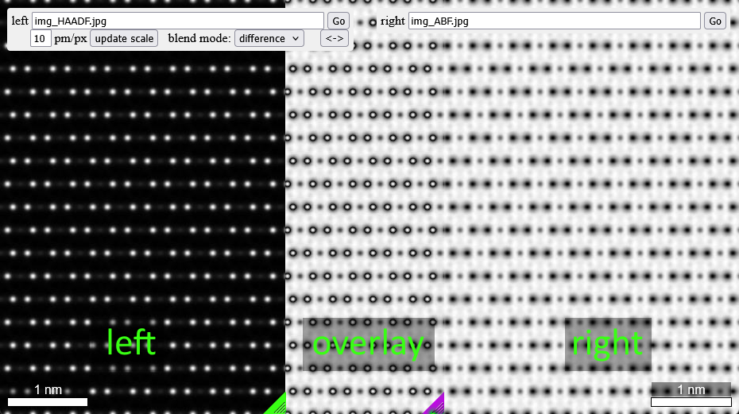

# simulationRepeat

A web-based side-by-side image viewer for comparing simulated microscopy images.  
[You can test/use it on GitHub pages.](https://rbtrrnss.github.io/simulationRepeat/)  
  
  

## Features

- **Side-by-Side Comparison**: View two simulated images simultaneously with a resizable divider
- **Drag & Drop**: Simply drag and drop images directly onto either panel
- **Tiled Background**: Images are automatically tiled/repeated to fill the viewing area
- **Custom Resolution**: Set pixels-per-picometer ratio to adjust scale bars (10 pm/px default)
- **URL Input**: Load images via file path or URL

## Usage

1. **Drag & Drop Method**:
   - Drag an image file onto the left or right panel
2. **Adjust Scale Bar**:
   - Enter pm/pixel value
   - Click "update scale" to adjust the scale bars
3. **Select blending mode for center panel**:
   - after choosing the blending mode
   - the center panel will show a correspondingly blended image
4. **Switch left and right image**:
   - click the `<->` button to switch images left/right

## Technical Details

- Pure HTML/CSS/JavaScript with jQuery
- No server required - runs entirely in the browser
- Supports standard image formats (jpg, png, etc.)
- Resizable left panel using CSS resize property

